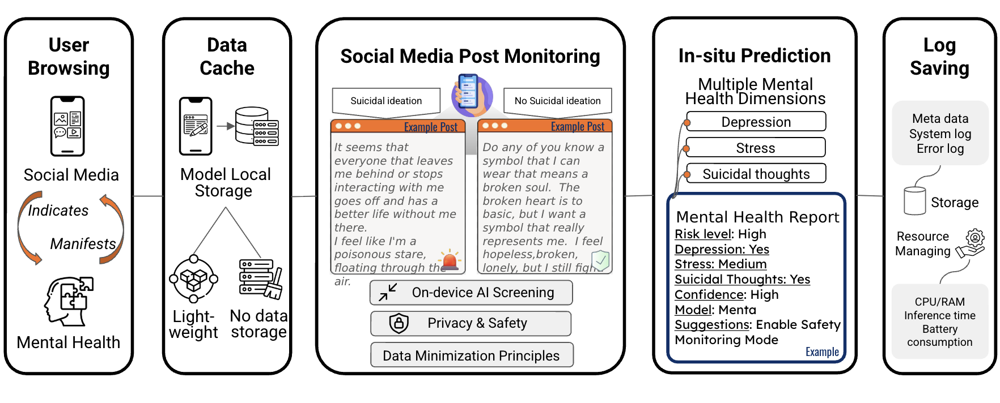

# MentaBench: A Multi-Task Benchmark for Mobile Mental Health Prediction with Small Language Models on Social Media Posts

<div align="center">



**Privacy-Preserving Mental Health Assessment Using Small Language Models on Mobile Devices**

</div>

## Overview

Mental health conditions affect hundreds of millions of people worldwide, yet scalable and privacy-preserving early detection
          remains limited. While large language models (LLMs) have demonstrated strong performance in mental health prediction, their com-
          putational cost and deployment constraints hinder practical use on personal devices. Small language models (SLMs) offer a promising
          alternative, but the lack of standardized benchmarks has limited systematic evaluation of their effectiveness for social media–based
          mental health prediction. In this work, we introduce MentaBench, a unified benchmark for multi-task mental health prediction from
          social media text, covering six classification tasks spanning depression, stress, and suicidality. The benchmark evaluates model
          accuracy, robustness across datasets, and on-device deployability, enabling fair comparison between SLMs and LLMs. As a refer-
          ence system, we present Menta, an optimized SLM trained using a LoRA-based multi-task framework with balanced accuracy–oriented
          objectives. Across nine state-of-the-art SLMs and multiple LLM baselines, Menta achieves an average improvement of 15.2% over
          non–fine-tuned SLMs and outperforms 13B-parameter LLMs on several tasks while being approximately 3.25× smaller. We further
          demonstrate real-time, on-device inference on an iPhone 15 Pro Max using approximately 3GB of memory. By providing evaluations
          among baseline models, MentaBench introduces reproducible comparison and highlights the potential of SLMs for scalable, privacy-
          preserving mental health monitoring.Mental health conditions affect hundreds of millions of people worldwide, yet scalable and privacy-preserving early detection
          remains limited. While large language models (LLMs) have demonstrated strong performance in mental health prediction, their com-
          putational cost and deployment constraints hinder practical use on personal devices. Small language models (SLMs) offer a promising
          alternative, but the lack of standardized benchmarks has limited systematic evaluation of their effectiveness for social media–based
          mental health prediction. In this work, we introduce MentaBench, a unified benchmark for multi-task mental health prediction from
          social media text, covering six classification tasks spanning depression, stress, and suicidality. The benchmark evaluates model
          accuracy, robustness across datasets, and on-device deployability, enabling fair comparison between SLMs and LLMs. As a refer-
          ence system, we present Menta, an optimized SLM trained using a LoRA-based multi-task framework with balanced accuracy–oriented
          objectives. Across nine state-of-the-art SLMs and multiple LLM baselines, Menta achieves an average improvement of 15.2% over
          non–fine-tuned SLMs and outperforms 13B-parameter LLMs on several tasks while being approximately 3.25× smaller. We further
          demonstrate real-time, on-device inference on an iPhone 15 Pro Max using approximately 3GB of memory. By providing evaluations
          among baseline models, MentaBench introduces reproducible comparison and highlights the potential of SLMs for scalable, privacy-
          preserving mental health monitoring.
## For more detailed deployment instructions, see [`Menta_deployment/`](./Menta_deployment)
## For more detailed training instructions, see [`Menta_pretraining_code/`](./Menta_pretraining_code)
### Key Features

- **Privacy-First**: All processing happens on-device, no data leaves your device
- **Mobile-Optimized**: Designed specifically for iOS devices with efficient resource usage
-**Multi-Dimensional Analysis**: Evaluates depression, stress, and suicidal thoughts
-**Real-Time Monitoring**: Provides immediate in-situ predictions
- **High Accuracy**: Fine-tuned SLMs for mental health assessment tasks

## Project Structure

This repository contains two main components:

### 1. [`Menta_deployment/`](./Menta_deployment) - Mobile Application & Model Deployment

This folder contains the iOS application for deploying the mental health monitoring model on mobile devices.

**Contents:**
- **Menta/**: SwiftUI-based iOS application
  - Mental health prediction interface
  - Real-time social media post analysis
  - Privacy-preserving data handling
  - Batch processing capabilities
- **llamacpp-framework/**: llama.cpp framework compiled for iOS
  - Optimized for Apple Silicon and ARM devices
  - XCFramework for multi-platform support (iOS, tvOS, visionOS)
  - Pre-built binaries for quick integration
- **Menta.xcodeproj/**: Xcode project configuration

**Key Features:**
- On-device AI screening
- Lightweight storage with no cloud dependency
- Real-time mental health report generation
- Resource monitoring (CPU, RAM, battery)
- Safety alert system for high-risk cases

### 2. [`Menta_pretraining_code/`](./Menta_pretraining_code) - Model Training & Fine-tuning

This folder contains all the code and datasets for training and fine-tuning the Menta model.

**Contents:**
- **Training Scripts**:
  - `Menta_lora_multitask_weighted_optimized.py`: Multi-task learning with LoRA fine-tuning
  - `Menta_lora_config1_logprob.py`: LoRA configuration with log probability implementation
  - `improved_logprob_implementation.py`: Enhanced log probability calculations
- **Datasets**:
  - Reddit depression dataset
  - Stress analysis dataset (Dreaddit)
  - Suicidal ideation dataset (SDCNL)
  - Multi-user mental health posts
- **Configuration**:
  - `config.yaml`: Training hyperparameters and model settings
  - `requirements.txt`: Python dependencies

**Training Approach:**
- Multi-task learning for depression, stress, and suicidal ideation detection
- LoRA (Low-Rank Adaptation) for efficient fine-tuning
- Weighted loss functions for balanced learning
- Log probability analysis for confidence estimation

## Quick Start

### For Model Deployment (iOS)

1. Navigate to the deployment folder:
```bash
cd Menta_deployment
```

2. Open the Xcode project:
```bash
open Menta.xcodeproj
```

3. Build and run on your iOS device or simulator

For detailed deployment instructions, see [`Menta_deployment/SETUP.md`](./Menta_deployment/SETUP.md)

### For Model Training

1. Navigate to the training folder:
```bash
cd Menta_pretraining_code
```

2. Install dependencies:
```bash
pip install -r requirements.txt
```

3. Configure training parameters in `config.yaml`

4. Start training:
```bash
python Menta_lora_multitask_weighted_optimized.py
```

For detailed training instructions, see [`Menta_pretraining_code/README.md`](./Menta_pretraining_code/README.md)

## How It Works

The Menta system follows a comprehensive workflow:

1. **User Browsing**: Monitors social media interactions where mental health states may manifest
2. **Data Cache**: Stores data locally with lightweight, privacy-preserving storage
3. **Social Media Post Monitoring**: 
   - Applies on-device AI screening
   - Adheres to privacy and data minimization principles
   - Identifies suicidal ideation and other mental health indicators
4. **In-situ Prediction**: Generates multi-dimensional mental health reports including:
   - Risk level assessment
   - Depression indicators
   - Stress levels
   - Suicidal thought detection
   - Confidence scores
5. **Log Saving**: Records metadata, system logs, and resource usage for performance monitoring

## Privacy & Security

- **Full On-Device Processing**: No data transmitted to external servers
- **Data Minimization**: Only essential data is temporarily cached locally
- **No Cloud Storage**: All processing and storage occurs on the user's device
- **Privacy by Design**: Built with privacy as the core principle

## Performance

The system is optimized for mobile devices with:
- Efficient CPU and RAM usage
- Low battery consumption
- Fast inference times
- Real-time prediction capabilities

## Technical Stack

### Deployment
- **Language**: Swift, SwiftUI
- **Platform**: iOS 15.0+
- **ML Framework**: llama.cpp (C++ inference)
- **Model Format**: GGUF (quantized models)

### Training
- **Language**: Python 3.8+
- **Frameworks**: PyTorch, Transformers
- **Techniques**: LoRA fine-tuning, multi-task learning
- **Base Models**: Small Language Models (SLMs)


